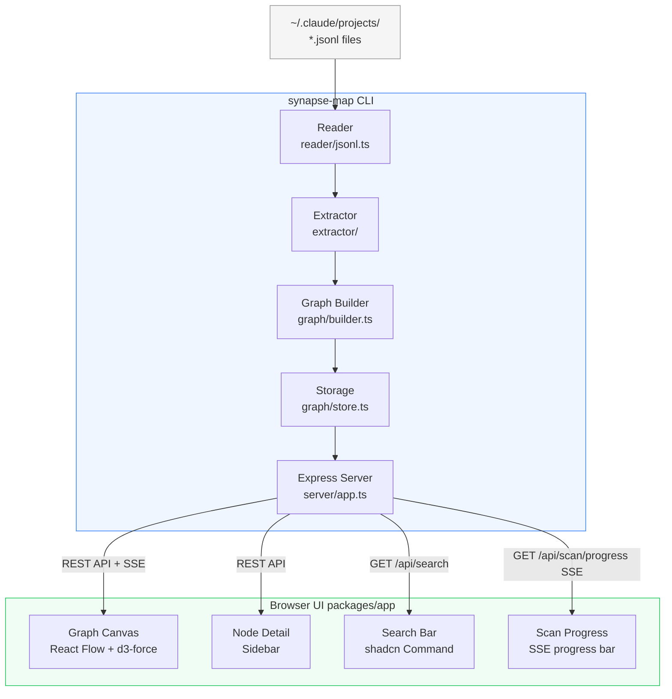
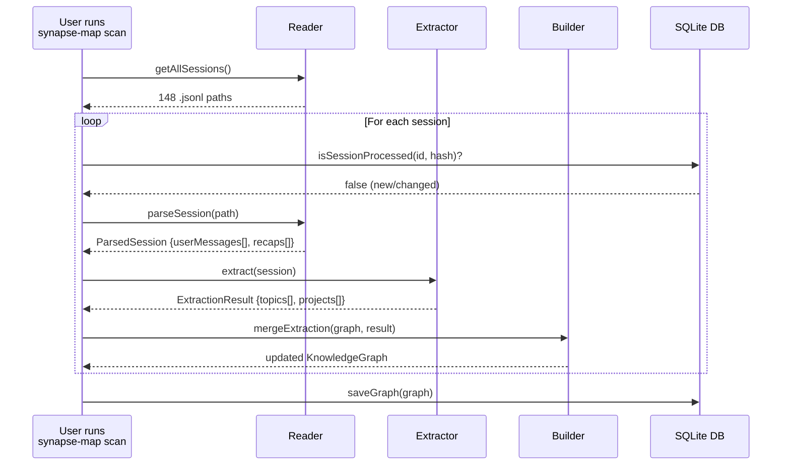
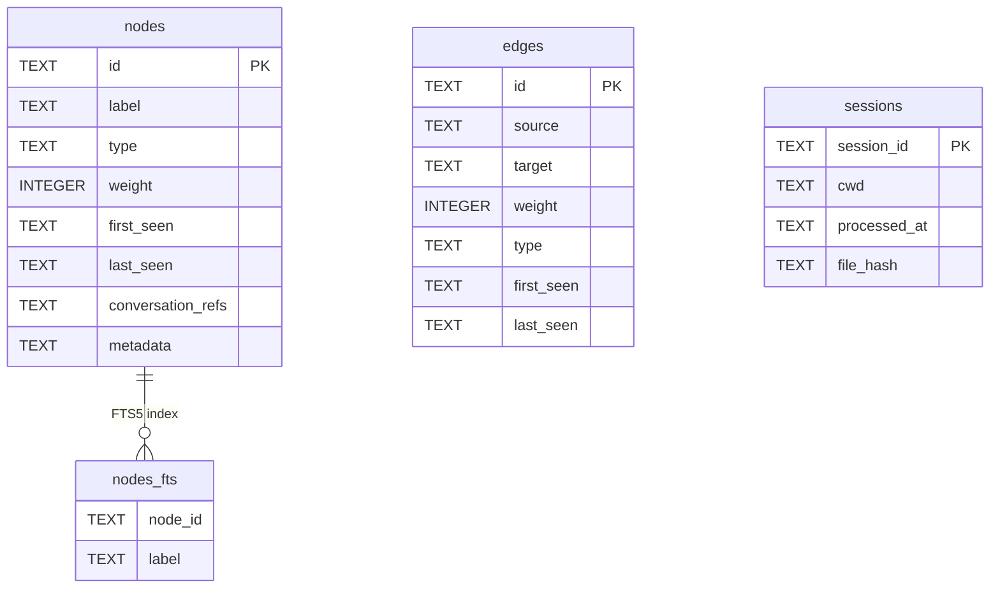

# Synapse Map — Architecture

This document is updated after each issue is completed. It explains what every file does, why it exists, and how the pieces connect.

---

## System Overview

Synapse Map transforms Claude Code conversation history into an interactive knowledge graph. It runs entirely on your local machine — no cloud, no API keys.



---

## Data Flow



---

## Module Reference

### `packages/cli/src/graph/types.ts`
**Why it exists:** Single source of truth for all TypeScript types. Every other module imports from here — changing a type here immediately surfaces type errors across the whole codebase.

| Type | Purpose |
|------|---------|
| `NodeType` | Union of node categories: `concept`, `project`, `decision`, `artifact`, `question`. Phase 1 uses `concept` and `project` only. |
| `GraphNode` | A single node in the knowledge graph. `id` is a stable slug (`"react"`), `weight` counts how many conversations mentioned it, `conversationRefs` lists which sessions. |
| `GraphEdge` | A connection between two nodes. `id` is always sorted alphabetically (`"react→typescript"`) to prevent duplicate edges. `weight` counts co-occurrences. |
| `KnowledgeGraph` | The full graph: `nodes` and `edges` stored as `Record<id, item>` (not arrays) for O(1) merge lookups. |
| `ProcessedSession` | Tracks which sessions have been indexed. `fileHash` (SHA-256) enables incremental scans — if the file hasn't changed, skip it. |
| `ParsedSession` | Output of the reader: the session's user messages as plain text, ready for extraction. Extended in #42 with `recaps` — end-of-session recap summaries collected from `system`/`away_summary` entries. |
| `ExtractionResult` | Output of the extractor: lists of topic and project labels extracted from one session. |
| `emptyGraph()` | Factory that creates a blank `KnowledgeGraph`. Used when no DB exists yet. |

---

### `packages/cli/src/reader/jsonl.ts`
**Why it exists:** Claude Code stores every conversation as a `.jsonl` file under `~/.claude/projects/`. This module is the only place in the codebase that knows about that file format.

| Function | Purpose |
|----------|---------|
| `getAllSessions()` | Walks `~/.claude/projects/` recursively and returns every `.jsonl` file path found. |
| `parseSession(filePath)` | Reads one `.jsonl` file. Extracts `type === "user"` lines — assistant messages and system events are skipped — plus (added in #42) `type === "system"` / `subtype === "away_summary"` entries: the LLM-written end-of-session recaps Claude Code stores in every transcript, collected into `recaps` with the `(disable recaps in /config)` UI suffix stripped. Handles two content formats: plain `string` and `array` (tool results mixed with text). Strips Claude Code system tags (`<system-reminder>`, `<bash-input>`, etc.) using a regex so only real user prose reaches the extractor. Returns `null` if the session has no usable messages. The recap format is an undocumented Claude Code internal — extraction supplements the other layers and degrades gracefully when recaps are absent. |
| `hashFile(filePath)` | SHA-256 of the raw file bytes. Used by `isSessionProcessed()` to skip unchanged sessions on re-scan. |

---

### `packages/cli/src/extractor/vocabulary.ts`
**Why it exists:** The fastest, highest-confidence extraction layer. A curated list of ~391 known tech terms (frameworks, languages, tools, databases, cloud platforms, AI/ML concepts, etc.) matched case-insensitively against conversation text.

Seeded from `job-search-tool/scripts/score_ats.py` `HARD_SKILLS` list and expanded with mobile, AI/ML, observability, architecture patterns, and more. No logic here — just the data.

---

### `packages/cli/src/extractor/aliases.ts`
**Why it exists:** Normalises variants before slugging so different spellings of the same concept map to one graph node.

Examples: `"postgres" → "PostgreSQL"`, `"ts" → "TypeScript"`, `"k8s" → "Kubernetes"`, `"rag" → "RAG"`. ~90 mappings covering abbreviations, casing variants, British/American spelling, and hyphen variants.

Seeded from `job-search-tool/scripts/score_ats.py` `TERM_ALIASES` and expanded.

---

### `packages/cli/src/extractor/tfidf.ts`
**Why it exists:** The static vocabulary can only find terms it already knows. TF-IDF finds terms that are *statistically unusual* in one session relative to the whole corpus — surfacing project-specific names (internal tools, company names, custom concepts) that no static list could contain.

| Export | Purpose |
|--------|---------|
| `TfIdf` class | Holds a corpus of tokenised documents. `addDocument()` adds a session. `topTerms(i)` returns the highest-scoring terms for document `i`. |
| `buildCorpus(sessionTexts)` | Convenience wrapper — tokenises all sessions and builds a `TfIdf` instance. |
| `topTermsForSession(messages, corpus, index)` | Returns the top N TF-IDF terms for one session, filtered to scores above 0.01 to remove near-zero noise. |

**Formula:** TF-IDF score = (term frequency in session) × log((N+1) / (df+1)) + 1, where N = total sessions and df = sessions containing the term. The +1 smoothing prevents division by zero on small corpora.

---

### `packages/cli/src/extractor/nlp.ts`
**Why it exists:** TF-IDF finds individual tokens; the vocabulary finds known terms. Neither reliably extracts multi-word proper noun phrases like "Knowledge Graph", "Clean Architecture", or "Domain Driven Design". `compromise.js` fills that gap with lightweight NLP noun phrase detection.

| Export | Purpose |
|--------|---------|
| `extractNounPhrases(text)` | Runs compromise NLP on the text, extracts nouns and proper nouns, title-cases them, filters against a 60-term stopword list (removes generic words like "thing", "issue", "user"), and drops phrases longer than 4 words or shorter than 3 characters. |

No model download — compromise is pure JavaScript, works fully offline.

---

### `packages/cli/src/extractor/index.ts`
**Why it exists:** Public barrel for the extractor subsystem. Re-exports the `Extractor` interface and `RuleBasedExtractor` so callers only need one import path. Future LLM extractors will also be exported here without callers changing their imports.

| Export | Purpose |
|--------|---------|
| `Extractor` (re-export) | The interface — re-exported from `graph/types.ts` for convenience. |
| `RuleBasedExtractor` (re-export) | The default extractor implementation. |

---

### `packages/cli/src/extractor/rule-based.ts`
**Why it exists:** Combines all four extraction layers (vocabulary, TF-IDF, NLP, session recaps) into a single class that implements the `Extractor` interface. This is the default engine for phase 1.

| Export | Purpose |
|--------|---------|
| `RuleBasedExtractor` | Class that wraps all four extraction layers. Constructor takes the full list of parsed sessions so it can build the TF-IDF corpus up front (recaps are included in each session's corpus document since #42). `extract(session)` runs all four layers, normalises results through the alias table and vocabulary canonical forms, and returns the deduped `ExtractionResult`. |

**How layers are combined:**
1. **Layer 1 (vocabulary)** — 391 precompiled regex patterns, run against the full message text. Fastest, highest confidence.
2. **Layer 2 (TF-IDF)** — up to 20 high-scoring tokens per session. Each token is normalised: aliases table → vocabulary canonical → title-case unknown words.
3. **Layer 3 (NLP)** — compromise noun phrases from the first 8000 chars of message text (capped for speed). Same normalisation pipeline.
4. **Layer 4 (session recaps)** — added in #42. Vocabulary matching + noun-phrase extraction over the session's `recaps` (LLM-written end-of-session summaries). Recaps are short, clean prose with high signal density, so the full text is processed — no 8000-char sampling. Sessions without recaps skip this layer entirely.

All four layers write into a single `Set<string>` so deduplication is free. Project name is extracted from the last path segment of `session.cwd`.

Also includes `escapeRe()` (local helper for building vocab regex) and `normalizeToken()` (alias → vocab → title-case pipeline, filters tokens < 3 chars).

---

### `packages/cli/src/graph/types.ts` — `Extractor` interface (added in #8)

```typescript
export interface Extractor {
  extract(session: ParsedSession): ExtractionResult;
}
```

Added to `types.ts` so the interface lives with its input/output types. Future LLM extractors (`OllamaExtractor`, `AnthropicExtractor`) will implement this interface — the scan command only ever sees `Extractor`, not the concrete class.

---

### `packages/cli/src/graph/builder.ts`
**Why it exists:** The bridge between extraction and storage. Takes raw labels from the extractor and merges them into the live `KnowledgeGraph` in memory — creating or incrementing nodes, generating co-occurrence edges, and recording the processed session. Everything `store.ts` saves, `builder.ts` produced.

| Export | Purpose |
|--------|---------|
| `toSlug(label)` | Converts a canonical label to a stable URL-safe node ID. Deterministic: same label always → same slug. Handles C++ → `cpp`, C# → `csharp`, Next.js → `next-js`, spaces → hyphens. |
| `mergeSession(graph, session, result, fileHash)` | Upserts all topics and projects from one `ExtractionResult` into the graph. Increments `weight` and appends `sessionId` to `conversationRefs` for existing nodes (idempotent — duplicate session IDs are skipped). Creates `related` edges for pairs of nodes in the session; since #44 a pair is only counted when the session is newly counted for at least one endpoint, so re-processing a session (`scan --force`) never inflates edge weights, and node ids are deduped before pairing so a topic and project slugging to the same id can't create a self-edge. No per-session cap on pair generation yet — see #45. Records the session in `processedSessions` with its file hash. |

**Edge ID format:** `[slugA]→[slugB]` with slugs sorted alphabetically — guarantees no duplicate edges regardless of extraction order.

---

### `packages/cli/src/commands/scan.ts`
**Why it exists:** The top-level orchestrator for the indexing pipeline. Wires together every lower-level module — reader, extractor, builder, store — into the single user-facing `synapse-map scan` workflow.

| Export | Purpose |
|--------|---------|
| `runScan(options)` | Discovers all `.jsonl` files, hashes each one, skips already-indexed sessions, parses the full corpus for TF-IDF accuracy, extracts topics per session, merges into the graph, and saves to SQLite. Accepts `{ force, dryRun }` options. |

**Incremental scan flow:**
1. Quick-filter using `basename(filePath)` as a proxy sessionId + SHA-256 hash → skip if already indexed
2. Parse ALL sessions into memory (needed for TF-IDF corpus quality)
3. Build `RuleBasedExtractor` from the full corpus
4. For each new/changed session: `extract` → `mergeSession` → accumulate in the in-memory graph
5. `saveGraph` once at the end (single transaction)

The secondary `isSessionProcessed(session.sessionId, hash)` check after parsing handles the rare case where a file's basename doesn't match its internal sessionId.

**Tested against 148 real sessions**: 145 parsed successfully, full scan produces ~5,844 nodes and ~16,726 edges in ~18s. Re-scan correctly skips already-indexed sessions.

---

### `packages/cli/src/graph/store.ts`
**Why it exists:** All graph data is persisted in a local SQLite database at `~/.synapse/graph.db`. This module is the only place that reads from or writes to that database.

Uses Node.js built-in `node:sqlite` (available since Node 22) — no native compilation required, no Visual Studio needed on Windows.

| Function | Purpose |
|----------|---------|
| `openDb()` | Opens (or creates) `~/.synapse/graph.db`, runs `CREATE TABLE IF NOT EXISTS` DDL, sets `PRAGMA journal_mode = WAL` for better concurrent read performance. Singleton — returns the same connection on subsequent calls. |
| `closeDb()` | Closes the connection and resets the singleton. Used by the `reset` command. |
| `isSessionProcessed(id, hash)` | Returns `true` if the session is already in the `sessions` table **and** its stored hash matches the current file hash. If either is false, the session needs processing. |
| `saveGraph(graph)` | Upserts all nodes, edges, and sessions inside a single `BEGIN`/`COMMIT` transaction. If anything fails, `ROLLBACK` ensures no partial writes. Node labels are also inserted into `nodes_fts` (FTS5) for full-text search. |
| `loadGraph()` | Reads all rows from `nodes`, `edges`, and `sessions`, deserialises JSON columns (`conversation_refs`, `metadata`), and returns a `KnowledgeGraph`. |
| `searchNodes(query)` | Appends `*` to the query for prefix matching and runs an FTS5 `MATCH` query on `nodes_fts` joined to `nodes`. Returns up to 20 matching nodes ordered by relevance rank. |

**Schema:**



---

## Server Layer (`packages/cli/src/server/`)

Added in issue #11. Exposes the SQLite graph over HTTP so the React frontend and browser-triggered scans can communicate with the CLI process.

### `packages/cli/src/server/app.ts`
**Why it exists:** Factory that builds and configures the Express application. Separating app creation from server startup (`app.ts` vs `commands/serve.ts`) keeps the API layer testable without binding to a port.

| Export | Purpose |
|--------|---------|
| `createApp()` | Creates an Express app with `cors()` + `express.json()` middleware, mounts all four route groups at `/api/*`, mounts static frontend serving via `serveStatic()` (added in #22), and returns the configured app. |

Route mounts: `/api/graph` → graph routes · `/api/search` → search · `/api/status` → status · `/api/scan` → scan trigger + SSE. Static serving is mounted last so the SPA catch-all route never shadows an API route.

---

### `packages/cli/src/server/static.ts`
**Why it exists:** Added in #22. Isolates static frontend serving from API route wiring so `createApp()` — not just the `synapse serve` command — always serves the built React app, and so any future caller of `createApp()` (tests, alternate entry points) gets identical behaviour without duplicating filesystem logic.

| Export | Purpose |
|--------|---------|
| `serveStatic(app)` | Mounts `express.static()` over the resolved `packages/cli/public/` directory, then registers a catch-all `GET *` route that serves `index.html` for any unmatched path — the standard single-page-app fallback so client-side routes don't 404 on a hard refresh. |

**Path resolution:** `publicDir` is resolved once at module load from `fileURLToPath(import.meta.url)`, walked up two directories to `packages/cli/public/`. This matches the compiled output layout (`dist/server/static.js` → `../../public`). The Vite build (`packages/app/vite.config.ts`, `build.outDir`) writes the frontend bundle there; the root `prepare` script (see `index.ts` below) ensures that build runs automatically on `npm install`.

---

### `packages/cli/src/server/routes/graph.ts`
**Why it exists:** Primary data endpoint. The React frontend fetches the full graph on load and navigates to individual nodes on click.

| Route | Purpose |
|-------|---------|
| `GET /api/graph` | Full `KnowledgeGraph` JSON — nodes, edges, processedSessions. |
| `GET /api/graph/nodes` | All nodes as an array. Accepts `?type=concept` to filter by node type. |
| `GET /api/graph/nodes/:id` | Single node by slug + all connected edges. Returns 404 if not found. |
| `GET /api/graph/edges` | All edges. Accepts `?minWeight=N` to return only heavily co-occurring pairs. |

---

### `packages/cli/src/server/routes/search.ts`
**Why it exists:** Powers the search bar in the UI. Delegates directly to `searchNodes()` in `store.ts`, which runs an FTS5 prefix-match query — no in-process filtering needed.

| Route | Purpose |
|-------|---------|
| `GET /api/search?q=react` | Returns up to 20 nodes whose labels prefix-match the query. Returns 400 if `q` is missing or empty. |

---

### `packages/cli/src/server/routes/status.ts`
**Why it exists:** Lightweight stats endpoint. The CLI's `synapse status` command and the UI header badge call this to display counts without loading the full graph into memory.

| Route | Purpose |
|-------|---------|
| `GET /api/status` | Returns `{ nodeCount, edgeCount, sessionCount, lastUpdated }` derived from `loadGraph()`. |

---

### `packages/cli/src/server/routes/scan.ts`
**Why it exists:** Enables browser-triggered re-scans and real-time progress feedback over Server-Sent Events. SSE was chosen over WebSockets because it's server-to-client only, requires no extra package, and auto-reconnects.

| Route | Purpose |
|-------|---------|
| `POST /api/scan` | Starts `runScan()` in a `setTimeout(..., 0)` so the 202 response is sent before the scan begins. Returns 409 if already running. |
| `GET /api/scan/progress` | Opens an SSE stream. Clients receive `started`, `completed`, or `error` events. Connection `close` event removes the client from `sseClients`. |

**Key internals:** `scanInProgress` (boolean flag) prevents concurrent scans. `sseClients` (Set of Response objects) allows broadcasting to multiple open browser tabs simultaneously.

---

### `packages/cli/src/index.ts`
**Why it exists:** The single entry point for the entire CLI. Uses Commander.js to define the `synapse` command with five subcommands (`scan`, `serve`, `status`, `reset`, `hook`), so users interact with one unified binary rather than separate scripts. Also implements zero-config default behavior: running `synapse` with no arguments auto-scans (if no database exists) then launches the web UI — the most common workflow in a single keystroke.

| Export / Behavior | Purpose |
|-------------------|---------|
| `program` (Commander instance) | Root command named `synapse` with version `0.1.0`. Delegates to subcommand handlers from `commands/`. |
| `synapse scan` | `--force` re-processes all sessions; `--dry-run` previews without writing. Delegates to `runScan()`. |
| `synapse serve` | `-p, --port <number>` (default 4242); `--no-open` suppresses browser launch. Delegates to `runServe()`. |
| `synapse status` | No options. Delegates to `runStatus()`. |
| `synapse reset` | No options. Delegates to `runReset()`. |
| `synapse hook install` / `synapse hook uninstall` | Added in #24. Delegates to `runHookInstall()` / `runHookUninstall()`. |
| Default (no subcommand) | Checks `process.argv.length <= 2`. If no DB exists, calls `runScan()` first, then always calls `runServe()`. Skips `program.parse()` entirely so Commander doesn't print help. |

**Package wiring:** `package.json` declares `"bin": { "synapse": "./dist/index.js", "synapse-map": "./dist/index.js" }` (the `synapse-map` alias was added in #24 so the literal command written into the Claude Code Stop hook resolves after a global install), so `npm install -g` or `npx` makes either command available system-wide. The `#!/usr/bin/env node` shebang enables direct execution on Unix. Added in #22: the root `prepare` script builds the React frontend into `packages/cli/public/` automatically on `npm install`, so the static assets `server/static.ts` serves exist even when the package is installed from git rather than built manually. Widened in #25 from `npm run build --workspace=packages/app` to `npm run build` (both workspaces), so `npm ci` in the [publish workflow](#githubworkflowspublishyml) also produces a fresh `packages/cli/dist/` before the workflow's typecheck and publish steps run. Added in #24: a `postinstall` script (`scripts/postinstall.js`) prints a reminder to run `synapse-map hook install` after every `npm install`.

---

### `packages/cli/src/commands/serve.ts`
**Why it exists:** The user-facing entry point for the graph UI. Starts the Express app — which already bundles the API and static frontend serving via `createApp()` — so the single `synapse serve` command runs the full stack in one process.

| Export | Purpose |
|--------|---------|
| `ServeOptions` | `{ port?, open? }` — port defaults to 4242; `open` defaults to `true`. |
| `runServe(options)` | Creates the Express app via `createApp()`, starts listening, logs the URL, and auto-opens the browser via the `open` package. Static file serving moved into `server/static.ts` in #22, so this function no longer touches the filesystem directly. |

---

### `packages/cli/src/commands/status.ts`
**Why it exists:** Quick health check — shows what's in the graph without starting a server. Useful to verify a scan completed correctly or to see the graph size before opening the UI.

| Export | Purpose |
|--------|---------|
| `runStatus()` | Loads the graph from SQLite, counts nodes by type (`concept` / `project`), counts edges and sessions, finds the latest `processedAt` timestamp, and prints a four-line summary to stdout. Exits early with a friendly message if no database exists yet. |

---

### `packages/cli/src/commands/reset.ts`
**Why it exists:** Safety valve for clearing a corrupted or stale graph without touching the user's source files. The confirmation prompt prevents accidental data loss since the SQLite database is the only copy of the indexed graph.

| Export | Purpose |
|--------|---------|
| `runReset()` | Checks whether `~/.synapse/graph.db` exists, then prompts `[y/N]` for confirmation. On `y`: calls `closeDb()` to release the SQLite connection, then `unlinkSync` to delete the file. Prints "Aborted." on anything else. |

---

### `packages/cli/src/commands/hook.ts`
**Why it exists:** Added in #24. Lets the graph refresh itself without the user remembering to run `synapse scan`. Claude Code's `Stop` hook fires a shell command after every conversation, so wiring `synapse-map scan` into it keeps the graph current automatically — the scan's SHA-256 hash check (`isSessionProcessed` in `graph/store.ts`) means the hook only pays the cost of the one session that just finished, not a full re-scan.

| Export | Purpose |
|--------|---------|
| `CLAUDE_SETTINGS_PATH` | `~/.claude/settings.json` — the same config file Claude Code itself reads for hooks, permissions, etc. |
| `runHookInstall()` | Reads and JSON-parses the existing settings file (treats a missing file as `{}`). Appends a `{ type: 'command', command: 'synapse-map scan' }` entry to the empty-matcher (`matcher: ''`, i.e. runs on every Stop event) block under `hooks.Stop`, creating that structure if absent — merging non-destructively so any existing hooks, matchers, or unrelated settings keys are preserved untouched. No-ops with a message if the hook is already present. |
| `runHookUninstall()` | Removes only the `synapse-map scan` command entry from every `hooks.Stop` matcher, then prunes any matcher left with zero hooks and the `Stop` / `hooks` keys entirely if they end up empty — so uninstalling never leaves dangling empty structures behind. No-ops with a message if there's nothing to remove. |

**Package wiring:** `package.json` adds a `synapse-map` bin alias (see `index.ts` below) so the hook's literal `synapse-map scan` command resolves once the package is installed globally, and a `postinstall` script reminds the user to run `synapse hook install`.

---

## Frontend Layer (`packages/app/src/`)

Added in issues #15–#17. The browser UI for exploring the knowledge graph, built with React Flow for canvas rendering and d3-force for automatic graph layout.

### `packages/app/src/api/client.ts`
**Why it exists:** Single place that knows the server's URL shape. All `fetch` calls go through here so the rest of the UI never hard-codes endpoint strings — if a route changes, only this file needs updating.

| Export | Purpose |
|--------|---------|
| `ApiNode` | Type for a node as returned by the server (`id`, `label`, `type`, `weight`, `firstSeen`, `lastSeen`, `conversationRefs?`). Added optional `conversationRefs` array in #19 so `NodeDetail` can list which sessions mentioned the node. |
| `ApiProcessedSession` | Type for a processed session record (`sessionId`, `cwd`, `processedAt`, `fileHash`). Added in #19 so the sidebar can display session working directories and dates. |
| `ApiEdge` | Type for an edge as returned by the server (`id`, `source`, `target`, `weight`, `type`). |
| `ApiGraph` | Full graph payload: `nodes` and `edges` as `Record<id, item>`, optional `processedSessions` map, plus `updatedAt`. Extended in #19 with `processedSessions` so the store can resolve session IDs to metadata. |
| `ApiStatus` | Stats payload: `nodeCount`, `edgeCount`, `lastUpdated`. |
| `api` | Object with typed wrappers for every endpoint: `graph()`, `nodes()`, `node(id)`, `edges()`, `search(q)`, `status()`, `scan()`, `scanProgress()`. `scanProgress()` returns an `EventSource` for the SSE stream. |

---

### `packages/app/src/lib/utils.ts`
**Why it exists:** shadcn/ui components rely on `cn()` to merge Tailwind class strings safely — `clsx` handles conditionals and arrays, `tailwind-merge` resolves conflicts between utility classes (e.g. `p-2` vs `p-4`).

| Export | Purpose |
|--------|---------|
| `cn(...inputs)` | Combines `clsx` + `tailwind-merge`. Accepts any mix of strings, arrays, and objects; returns a single deduplicated class string. |

---

### `packages/app/src/store/graphStore.ts`
**Why it exists:** Central client-side state for the entire UI. Co-locating the data-fetching logic with the state it produces means every component reads from the same source and re-renders together — no prop drilling, no duplicate fetch calls.

| Export | Purpose |
|--------|---------|
| `GraphNode` (re-export of `ApiNode`) | Node type used throughout the UI layer. |
| `GraphEdge` (re-export of `ApiEdge`) | Edge type used throughout the UI layer. |
| `useGraphStore` | Zustand store hook. Exposes `nodes`, `edges`, `processedSessions`, `selectedNodeId`, `focusNodeId`, `searchQuery`, `isScanning`, `scanProgress`, and six actions. |

**State (added in #19, extended in #20):**

| Field | Purpose |
|-------|---------|
| `processedSessions` | `Record<string, ApiProcessedSession>` — session metadata (cwd, date) keyed by session ID. Populated by `loadGraph()` from the API's `processedSessions` map so `NodeDetail` can resolve `conversationRefs` to human-readable info without extra API calls. |
| `focusNodeId` | Transient string set by `focusNode()` — signals `GraphCanvas` to pan-and-zoom to a specific node. Cleared immediately after the camera animation starts. Added in #20 so `SearchBar` can navigate the canvas to a search result. |

**Actions:**

| Action | Behaviour |
|--------|-----------|
| `loadGraph()` | Fetches `GET /api/graph`, converts the `Record<id, item>` maps to flat arrays, stores `processedSessions` map, and writes to `nodes`/`edges`. |
| `selectNode(id)` | Sets `selectedNodeId`; pass `null` to deselect. |
| `focusNode(id)` | Sets both `selectedNodeId` and `focusNodeId` so the canvas pans to the node and the sidebar opens simultaneously. Added in #20. |
| `clearFocusNode()` | Resets `focusNodeId` to `null` after the camera animation has been triggered. Added in #20. |
| `setSearchQuery(q)` | Updates `searchQuery` string (consumed by `SearchBar`). |
| `triggerScan()` | POSTs to `/api/scan`, opens an SSE connection to `/api/scan/progress`, updates `scanProgress` (0–100) on each `progress` event, and calls `loadGraph()` on `complete`. Guards against concurrent scans with `isScanning`. |

---

### `packages/app/src/App.tsx`
**Why it exists:** Root component that composes the top-level layout — canvas, overlays, and sidebar — into a single full-screen shell. Centralising the layout here means child components never position themselves globally; they only fill their allocated slot.

| Export | Purpose |
|--------|---------|
| `default` (`App` component) | Renders a full-viewport flex container with three layers: `ScanProgress` (absolute top bar, z-20), `SearchBar` (absolute centered top, z-10), `GraphCanvas` (fills remaining space), and `NodeDetail` (right sidebar). |

---

### `packages/app/src/components/ScanProgress.tsx`
**Why it exists:** Provides real-time visual feedback during a scan so users know the system is working and can estimate remaining time. Reads `isScanning` and `scanProgress` from the Zustand store (which are driven by SSE events from `GET /api/scan/progress`), keeping the component stateless and decoupled from the SSE transport.

| Export | Purpose |
|--------|---------|
| `default` (`ScanProgress` component) | Renders a thin (4 px) progress bar pinned to the top of the viewport. Width transitions smoothly via CSS `transition-[width]` at 300 ms ease-out. Returns `null` when `isScanning` is false so the bar is completely removed from the DOM between scans. |

---

### `packages/app/src/components/ConceptNode.tsx`
**Why it exists:** Custom React Flow node renderer that visually encodes graph metadata — node type via colour, weight via size/badge, selection/hover via border glow — so users can scan the canvas and immediately spot important or related concepts without reading labels. Rebuilt in #18 to use shadcn Card + Badge instead of raw circles. Extended in #34 with three distinct render modes (`dot` / `compact` / `card`) driven by zoom-level LOD so thousands of nodes can render at once without every node paying the cost of a full shadcn `Card` — far-zoom views stay cheap DOM (a single styled `div`) while close-up views keep the rich, readable card.

| Export | Purpose |
|--------|---------|
| `ConceptNodeData` (type) | Shape of the data payload each React Flow node carries: `label`, `type`, `weight`, `highlighted`, `expanded`, optional `lod` (`0`–`3`, defaults to `3`/closest), optional `connections`. Used by `GraphCanvas` when building the `Node<ConceptNodeData>[]` array. |
| `getRenderMode(lod, weight)` | Pure function mapping a node's LOD level + weight to a `RenderMode`. LOD 0 always renders `dot`. LOD 1 renders `compact` only if `weight >= 60`, else `dot`. LOD 2 renders `card` only if `weight >= 40`, else `compact`. LOD 3 always renders `card`. Exported so `GraphCanvas` can compute the same mode for sizing without duplicating the thresholds. |
| `NODE_DIMENSIONS` | `Record<RenderMode, {width, height} | undefined>` — fixed pixel sizes for `dot` (24×24) and `compact` (90×44) so React Flow can size the node wrapper before render; `card` is `undefined` because its size is intrinsic (content-driven), matching pre-#34 behaviour. |
| `default` (memoised component) | Picks a `RenderMode` via `getRenderMode(data.lod, data.weight)` and branches rendering accordingly (see Render modes below). Wrapped in `memo` to avoid re-renders when siblings change. |

**Render modes (added in #34):**

| Mode | Rendering | Used when |
|------|-----------|-----------|
| `dot` | A single coloured circle (`dotSize` 8–22 px, scaled by weight), no label. Highlight adds a glow ring. | Zoomed far out — cheapest possible node, used for the bulk of low-weight nodes at LOD 0/1. |
| `compact` | The same coloured dot plus a truncated title-cased label (max 80 px wide, 9 px text) underneath. | Mid-zoom — enough detail to read labels without the cost of a full card. |
| `card` | Full shadcn `Card` + `Badge` rendering (unchanged from #18): scaled font size (9–13 px), weight badge (size/variant shift at thresholds 3, 5, 10), type dot, expanded-state indicator dot, and the hover debug tooltip listing connections. | Zoomed in close, or any node whose weight clears the LOD threshold — the original "rich" rendering. |

All three modes share hidden top/bottom `Handle`s so edges connect without visible anchors.

**Colour palette:** `concept` → indigo, `project` → emerald, `function` → violet, `class` → purple, `module` → blue, `file` → cyan, `variable` → teal, `type` → amber, `interface` → orange. Falls back to slate for unknown types.

**Internal helpers:** `toTitleCase(str)` capitalises the first letter of each word for display labels. `TYPE_COLORS` is a plain `Record<string, string>` mapping type slugs to hex colours.

---

### `packages/app/src/components/ui/card.tsx`
**Why it exists:** shadcn/ui Card primitive used by `ConceptNode` as the visual container for each graph node. Extracted as a shared component so future UI surfaces (sidebar panels, detail views) can reuse the same card styling and dark-mode tokens.

| Export | Purpose |
|--------|---------|
| `Card` | `forwardRef` div with rounded border, `bg-card` background, and subtle shadow. Accepts standard HTML div props + `className` overrides via `cn()`. |
| `CardContent` | Inner content wrapper with default `p-3` padding. `ConceptNode` overrides this to `p-1.5` for compact graph nodes. |

---

### `packages/app/src/components/ui/badge.tsx`
**Why it exists:** shadcn/ui Badge primitive that displays the numeric weight inside each `ConceptNode`. Uses `class-variance-authority` (CVA) for type-safe variant/size combinations, keeping conditional class logic out of the node component.

| Export | Purpose |
|--------|---------|
| `Badge` | Renders a rounded pill `<div>` with variant (`default`, `secondary`, `outline`) and size (`sm`, `default`, `lg`) props. `ConceptNode` selects variant/size based on weight thresholds to visually distinguish low- vs high-weight nodes. |
| `badgeVariants` | CVA definition exported for reuse — callers can generate badge class strings without rendering a component (e.g. for server-side or utility contexts). |

---

### `packages/app/src/components/GraphCanvas.tsx`
**Why it exists:** The central UI surface. Bridges the Zustand graph store (flat arrays of `GraphNode`/`GraphEdge`) to React Flow's rendering model, using d3-force to compute spatial positions so users see a meaningful layout rather than a pile of overlapping circles.

| Export | Purpose |
|--------|---------|
| `default` (`GraphCanvas` component) | Top-level wrapper that provides `ReactFlowProvider` context and renders the inner canvas at full width/height. |
| `GraphCanvasInner` (internal) | Core logic: loads graph data on mount, selects the top 50 nodes by weight, expands neighbours on click, computes force-directed layout, and maps store data to React Flow node/edge arrays. |
| `computeLayout(graphNodes, graphEdges)` (internal) | Runs a synchronous d3-force simulation (300 ticks) with link, charge, center, and collide forces. Returns a `Map<id, {x, y}>` of settled positions. Called once per visible-set change and cached in a ref. |
| `ForceNode` (internal interface) | Extends `SimulationNodeDatum` with `id: string` for type-safe d3-force simulation. |

**Key behaviours:**

| Behaviour | Detail |
|-----------|--------|
| **Progressive disclosure** | Only the top 50 highest-weight nodes render initially (`INITIAL_NODE_LIMIT`). Clicking a node toggles it "expanded", adding all its edge neighbours to the visible set. |
| **Hover highlighting** | On mouse-enter, the hovered node and all directly connected nodes/edges highlight (indigo stroke, full opacity). Non-connected elements fade to 20% opacity. |
| **Edge weight encoding** | Edge stroke width scales linearly from 1 to 6 px based on weight relative to the visible maximum. |
| **Layout caching** | `layoutCache` ref persists positions across renders so nodes don't jump when the visible set changes incrementally. |
| **Fit-to-view** | After initial render, `fitView()` is called with 0.2 padding after a 50 ms delay to ensure React Flow has measured the canvas. |
| **Focus-node fly-to** | When `focusNodeId` is set in the store (by `SearchBar`), the canvas calls `setCenter()` to smoothly pan and zoom (1.5×) to that node's layout position, then clears the flag. Added in #20. |
| **LOD-driven node sizing** | Added in #34. `lod` (0–3) is derived from the current `zoom` level and passed into each node's `data`. Before building the React Flow node array, `NODE_DIMENSIONS[getRenderMode(lod, n.weight)]` (both imported from `ConceptNode.tsx`) is used to set an explicit `style` width/height for `dot`/`compact` nodes, so React Flow reserves the right amount of canvas space without waiting for the node to render before measuring. `card` mode nodes get no explicit style — their size stays intrinsic. |

**Force simulation parameters:** link distance = 120, charge strength = −300, center at (0, 0), collision radius = 40.

---

### `packages/app/src/components/NodeDetail.tsx`
**Why it exists:** The detail sidebar for a selected graph node. Separating node inspection into a dedicated panel — rather than a modal or tooltip — lets users compare the sidebar content with the canvas simultaneously, and clicking related nodes in the sidebar navigates without losing context.

| Export | Purpose |
|--------|---------|
| `default` (`NodeDetail` component) | Renders a collapsible `<aside>` that slides in from the right when `selectedNodeId` is set. Width animates between `w-0` (collapsed) and `w-80` (expanded) via CSS `transition-all`. |

**Sections displayed (when a node is selected):**

| Section | Detail |
|---------|--------|
| **Header** | Node label (truncated), type dot with colour from `TYPE_COLORS`, and a close button that calls `selectNode(null)`. |
| **Weight** | Large `Badge` showing the numeric weight with a "conversations" label. |
| **Timeline** | First seen / last seen dates formatted via `formatDate()` (`toLocaleDateString` with short month). |
| **Related nodes** | Edges connected to the selected node, sorted by edge weight descending. Each row shows the neighbour's label (with type-colour dot) and edge weight in an outline `Badge`. Clicking a neighbour calls `selectNode(neighbourId)` to navigate the sidebar in-place. |
| **Conversations** | `conversationRefs` resolved to session metadata via `processedSessions` from the store. Shows session ID (monospace), working directory, and processed date. Sorted by date descending. |

**Internal helpers:** `TYPE_COLORS` is the same colour palette as `ConceptNode` (indigo for concept, emerald for project, etc.). `formatDate(iso)` formats ISO strings to locale-aware "MMM D, YYYY" display.

---

### `packages/app/src/components/SearchBar.tsx`
**Why it exists:** The primary discovery mechanism for the knowledge graph. Users with thousands of nodes need a way to jump directly to a concept without scrolling or zooming — this component provides a `Cmd+K` / `Ctrl+K` command palette that searches nodes via the server's FTS5 index and navigates the canvas on selection.

| Export | Purpose |
|--------|---------|
| `default` (`SearchBar` component) | Renders a trigger button (collapsed state) or a full `Command` palette (expanded state). Typing queries the `GET /api/search?q=` endpoint with 200 ms debounce. Selecting a result calls `focusNode(id)` to pan the canvas and open the sidebar simultaneously, then closes the palette. |

**Key behaviours:**

| Behaviour | Detail |
|-----------|--------|
| **Keyboard shortcut** | `Cmd+K` / `Ctrl+K` toggles the palette open/closed. `Escape` closes it. Listeners are registered on `document` and cleaned up on unmount. |
| **Debounced search** | Input changes are debounced at 200 ms via a `setTimeout` ref to avoid hammering the API on fast typing. Empty queries clear results immediately without a network call. |
| **Result display** | Each result row shows: a coloured type dot (same `TYPE_COLORS` palette as `ConceptNode`), the node label, node type text, and a weight `Badge`. |
| **Server-side filtering** | `shouldFilter={false}` disables cmdk's built-in client-side filtering since results are already ranked by the FTS5 engine. |

---

### `packages/app/src/components/ui/command.tsx`
**Why it exists:** shadcn/ui wrapper around the `cmdk` (Command Menu) library, styled with the project's dark-mode design tokens. Extracted as a shared UI primitive so `SearchBar` (and future command-palette features) get consistent styling without duplicating class strings.

| Export | Purpose |
|--------|---------|
| `Command` | Root container — full-width flex column with `bg-card` background and rounded corners. Wraps `cmdk`'s `CommandPrimitive`. |
| `CommandInput` | Text input with a bottom border divider. Transparent background so it inherits the card surface. Placeholder uses `text-muted-foreground`. |
| `CommandList` | Scrollable results container capped at `max-h-72` (288 px) with hidden horizontal overflow. |
| `CommandEmpty` | Centered message shown when no items match (e.g. "No results found." or "Type to search…"). |
| `CommandGroup` | Groups items under an optional heading. Applies compact padding and muted heading styles via `[cmdk-group-heading]` attribute selectors. |
| `CommandItem` | Individual result row — flex layout with `gap-2`, cursor pointer, and `data-[selected=true]` highlight using `bg-muted`. |

All components are `forwardRef` wrappers that accept standard HTML/cmdk props plus `className` overrides via `cn()`.

---

### `packages/app/src/index.css`
**Why it exists:** Defines the dark-mode design tokens (CSS custom properties) that shadcn/ui components consume. Centralising colour definitions here — rather than in Tailwind config or inline styles — means swapping themes or adding a light mode requires editing one file.

| Token | Purpose |
|-------|---------|
| `--background` / `--foreground` | Page-level colours (deep navy background, near-white text). |
| `--card` / `--card-foreground` | Card surface colours — currently match `--background` so cards blend with the canvas. |
| `--muted` / `--muted-foreground` | Subdued text and surfaces (type labels, secondary info). |
| `--border` | Default border colour applied globally via `* { border-color }`. |
| `--ring` | Focus-ring colour (indigo) for keyboard-accessible components. |
| `--radius` | Base border-radius (`0.5rem`) consumed by Tailwind's `rounded-lg/md/sm` utilities. |

---

### `packages/app/tailwind.config.js`
**Why it exists:** Extends the default Tailwind theme to wire up the CSS custom properties from `index.css` as first-class Tailwind utilities (`bg-card`, `text-muted-foreground`, `rounded-lg`, etc.), so shadcn/ui components work correctly. Also defines the `node-appear` animation used by `ConceptNode` for smooth entry transitions.

| Extension | Purpose |
|-----------|---------|
| `colors.*` | Maps semantic names (`background`, `foreground`, `card`, `muted`, `border`, `ring`) to `hsl(var(--*))` so Tailwind classes resolve to the CSS tokens. |
| `borderRadius.*` | Derives `lg`, `md`, `sm` from `--radius` so all rounded corners stay in sync. |
| `keyframes.node-appear` | Scale-up + fade-in animation (0.8 → 1 scale, 0 → 1 opacity) over 0.3s ease-out. |
| `animation.node-appear` | Shorthand class `animate-node-appear` applied by `ConceptNode`'s Card wrapper. |

---

### `packages/app/vite.config.ts`
**Why it exists:** Configures Vite for the frontend dev server and production build. The `server.proxy` rule (added in #19) forwards `/api/*` requests to the Express backend at `localhost:4242` during development, so `npm run dev` works without CORS issues or hard-coded origins. The production build outputs to `packages/cli/public/` so the CLI can serve the frontend as static files.

| Config | Purpose |
|--------|---------|
| `plugins` | `@vitejs/plugin-react` for JSX transform and Fast Refresh. |
| `server.proxy` | Proxies `/api` requests to `http://localhost:4242` — the Express API. Enables `npm run dev` to run Vite's HMR server on port 5173 while API calls transparently reach the backend. |
| `build.outDir` | Outputs compiled assets to `packages/cli/public/` so `synapse serve` can host them as static files. `emptyOutDir: true` cleans stale files on rebuild. |
| `resolve.alias` | Maps `@` to `./src` for cleaner import paths. |

---

## CI/CD

Added in issue #25. Automates publishing the CLI package to npm so releases no longer require a manual `npm publish` from a developer machine.

### `.github/workflows/publish.yml`
**Why it exists:** Removes the manual, error-prone npm publish step from the release process. Tying the workflow to git tags (`v*`) means a release is triggered by the same action that marks a version in git history, so the published npm version and the tagged commit can never drift apart.

| Step | Purpose |
|------|---------|
| `Checkout repo` | Uses `actions/checkout@v4` to pull the tagged commit. |
| `Set up Node.js` | Uses `actions/setup-node@v4` with Node 22 and `registry-url: https://registry.npmjs.org`, which also configures the local `.npmrc` for token-based auth used by the `Publish` step. |
| `Install dependencies` | `npm ci` — installs the full monorepo workspace tree and runs the root `prepare` script (see `index.ts` below). |
| `Build` | `npm run build` — builds both `packages/cli` and `packages/app` so the published tarball's `dist/` and `public/` (bundled frontend) are current. |
| `Typecheck` | `npm run typecheck --workspaces` — fails the workflow before publishing if either workspace has type errors. |
| `Publish` | `npm publish --access public` run with `working-directory: packages/cli`, so only the `synapse-map` CLI package (not the private workspace root or the `app` package) is published. Auth comes from `NODE_AUTH_TOKEN`, sourced from the `NPM_TOKEN` repository secret. |

**Trigger:** `on: push: tags: - 'v*'` — the workflow only runs when a tag matching `v*` (e.g. `v0.2.0`) is pushed, not on every push to `main`. This keeps routine commits from triggering npm releases.

---

## What's Next

```mermaid
flowchart LR
    subgraph Done ["✅ Done (#1–#22, #24–#25, #42)"]
        T1["#1 Monorepo"]
        T2["#2 Types"]
        T3["#3 JSONL Reader"]
        T4["#4 SQLite Store"]
        T5["#5–#7 Extractors"]
        T8["#8 RuleBasedExtractor"]
        T9["#9 Merge Algorithm"]
        T10["#10 Scan Command"]
        T11["#11 Express API"]
        T12["#12 Serve Command"]
        T13["#13 Status + Reset"]
        T14["#14 CLI Entry Point"]
        T15["#15 Scaffold Frontend"]
        T16["#16 Zustand Store"]
        T17["#17 React Flow Canvas"]
        T18["#18 Custom ConceptNode"]
        T19["#19 NodeDetail Sidebar"]
        T20["#20 SearchBar"]
        T21["#21 ScanProgress"]
        T22["#22 Vite Output + Static Serving"]
        T24["#24 Stop Hook Auto-Refresh"]
        T25["#25 npm Publish Workflow"]
        T42["#42 Session Recap Extraction"]
    end
```


