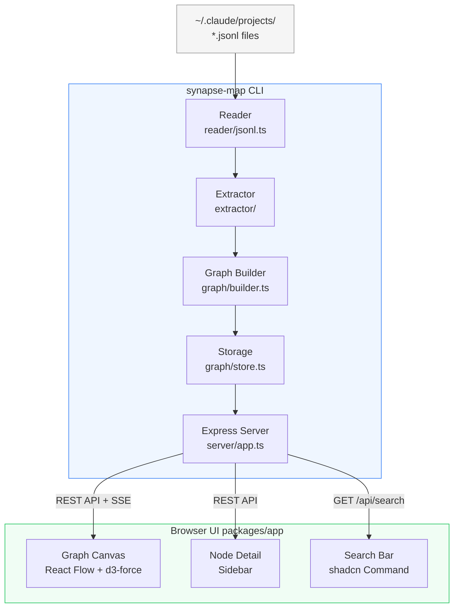
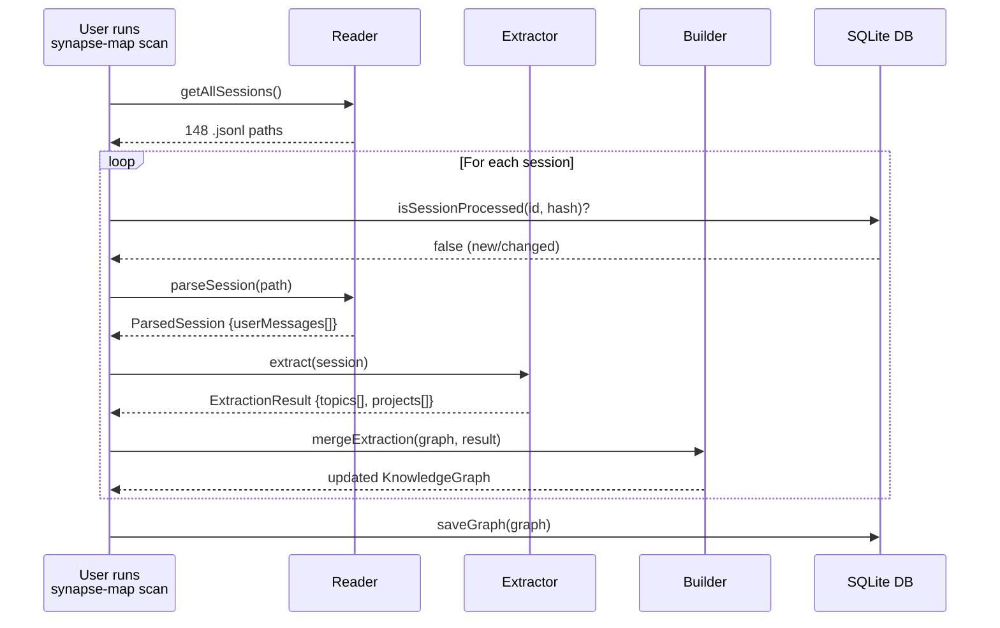
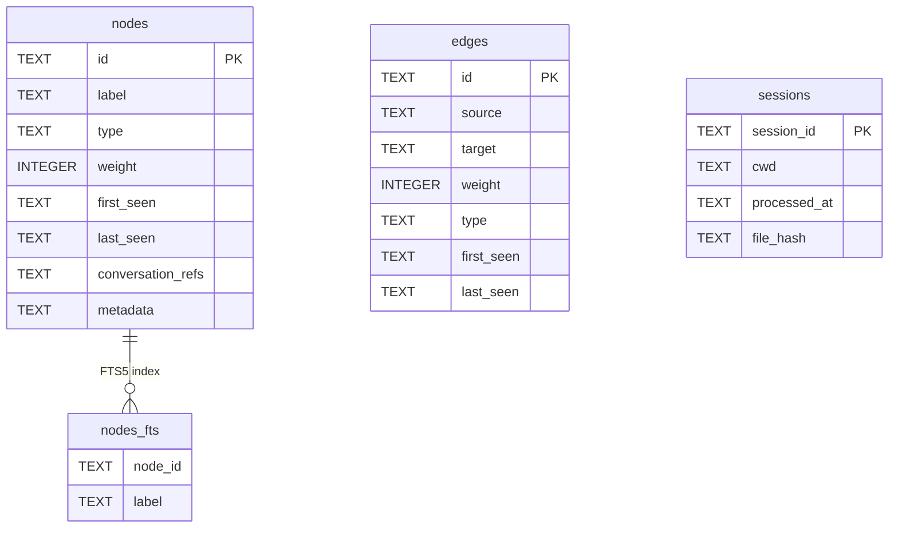

# Synapse Map — Architecture

This document is updated after each issue is completed. It explains what every file does, why it exists, and how the pieces connect.

---

## System Overview

Synapse Map transforms Claude Code conversation history into an interactive knowledge graph. It runs entirely on your local machine — no cloud, no API keys.



---

## Data Flow



---

## Module Reference

### `packages/cli/src/graph/types.ts`
**Why it exists:** Single source of truth for all TypeScript types. Every other module imports from here — changing a type here immediately surfaces type errors across the whole codebase.

| Type | Purpose |
|------|---------|
| `NodeType` | Union of node categories: `concept`, `project`, `decision`, `artifact`, `question`. Phase 1 uses `concept` and `project` only. |
| `GraphNode` | A single node in the knowledge graph. `id` is a stable slug (`"react"`), `weight` counts how many conversations mentioned it, `conversationRefs` lists which sessions. |
| `GraphEdge` | A connection between two nodes. `id` is always sorted alphabetically (`"react→typescript"`) to prevent duplicate edges. `weight` counts co-occurrences. |
| `KnowledgeGraph` | The full graph: `nodes` and `edges` stored as `Record<id, item>` (not arrays) for O(1) merge lookups. |
| `ProcessedSession` | Tracks which sessions have been indexed. `fileHash` (SHA-256) enables incremental scans — if the file hasn't changed, skip it. |
| `ParsedSession` | Output of the reader: the session's user messages as plain text, ready for extraction. |
| `ExtractionResult` | Output of the extractor: lists of topic and project labels extracted from one session. |
| `emptyGraph()` | Factory that creates a blank `KnowledgeGraph`. Used when no DB exists yet. |

---

### `packages/cli/src/reader/jsonl.ts`
**Why it exists:** Claude Code stores every conversation as a `.jsonl` file under `~/.claude/projects/`. This module is the only place in the codebase that knows about that file format.

| Function | Purpose |
|----------|---------|
| `getAllSessions()` | Walks `~/.claude/projects/` recursively and returns every `.jsonl` file path found. |
| `parseSession(filePath)` | Reads one `.jsonl` file. Extracts only `type === "user"` lines — assistant messages and system events are skipped. Handles two content formats: plain `string` and `array` (tool results mixed with text). Strips Claude Code system tags (`<system-reminder>`, `<bash-input>`, etc.) using a regex so only real user prose reaches the extractor. Returns `null` if the session has no usable messages. |
| `hashFile(filePath)` | SHA-256 of the raw file bytes. Used by `isSessionProcessed()` to skip unchanged sessions on re-scan. |

---

### `packages/cli/src/extractor/vocabulary.ts`
**Why it exists:** The fastest, highest-confidence extraction layer. A curated list of ~391 known tech terms (frameworks, languages, tools, databases, cloud platforms, AI/ML concepts, etc.) matched case-insensitively against conversation text.

Seeded from `job-search-tool/scripts/score_ats.py` `HARD_SKILLS` list and expanded with mobile, AI/ML, observability, architecture patterns, and more. No logic here — just the data.

---

### `packages/cli/src/extractor/aliases.ts`
**Why it exists:** Normalises variants before slugging so different spellings of the same concept map to one graph node.

Examples: `"postgres" → "PostgreSQL"`, `"ts" → "TypeScript"`, `"k8s" → "Kubernetes"`, `"rag" → "RAG"`. ~90 mappings covering abbreviations, casing variants, British/American spelling, and hyphen variants.

Seeded from `job-search-tool/scripts/score_ats.py` `TERM_ALIASES` and expanded.

---

### `packages/cli/src/extractor/tfidf.ts`
**Why it exists:** The static vocabulary can only find terms it already knows. TF-IDF finds terms that are *statistically unusual* in one session relative to the whole corpus — surfacing project-specific names (internal tools, company names, custom concepts) that no static list could contain.

| Export | Purpose |
|--------|---------|
| `TfIdf` class | Holds a corpus of tokenised documents. `addDocument()` adds a session. `topTerms(i)` returns the highest-scoring terms for document `i`. |
| `buildCorpus(sessionTexts)` | Convenience wrapper — tokenises all sessions and builds a `TfIdf` instance. |
| `topTermsForSession(messages, corpus, index)` | Returns the top N TF-IDF terms for one session, filtered to scores above 0.01 to remove near-zero noise. |

**Formula:** TF-IDF score = (term frequency in session) × log((N+1) / (df+1)) + 1, where N = total sessions and df = sessions containing the term. The +1 smoothing prevents division by zero on small corpora.

---

### `packages/cli/src/extractor/nlp.ts`
**Why it exists:** TF-IDF finds individual tokens; the vocabulary finds known terms. Neither reliably extracts multi-word proper noun phrases like "Knowledge Graph", "Clean Architecture", or "Domain Driven Design". `compromise.js` fills that gap with lightweight NLP noun phrase detection.

| Export | Purpose |
|--------|---------|
| `extractNounPhrases(text)` | Runs compromise NLP on the text, extracts nouns and proper nouns, title-cases them, filters against a 60-term stopword list (removes generic words like "thing", "issue", "user"), and drops phrases longer than 4 words or shorter than 3 characters. |

No model download — compromise is pure JavaScript, works fully offline.

---

### `packages/cli/src/extractor/index.ts`
**Why it exists:** Public barrel for the extractor subsystem. Re-exports the `Extractor` interface and `RuleBasedExtractor` so callers only need one import path. Future LLM extractors will also be exported here without callers changing their imports.

| Export | Purpose |
|--------|---------|
| `Extractor` (re-export) | The interface — re-exported from `graph/types.ts` for convenience. |
| `RuleBasedExtractor` (re-export) | The default extractor implementation. |

---

### `packages/cli/src/extractor/rule-based.ts`
**Why it exists:** Combines all three extraction layers (vocabulary, TF-IDF, NLP) into a single class that implements the `Extractor` interface. This is the default engine for phase 1.

| Export | Purpose |
|--------|---------|
| `RuleBasedExtractor` | Class that wraps all three extraction layers. Constructor takes the full list of parsed sessions so it can build the TF-IDF corpus up front. `extract(session)` runs all three layers, normalises results through the alias table and vocabulary canonical forms, and returns the deduped `ExtractionResult`. |

**How layers are combined:**
1. **Layer 1 (vocabulary)** — 391 precompiled regex patterns, run against the full message text. Fastest, highest confidence.
2. **Layer 2 (TF-IDF)** — up to 20 high-scoring tokens per session. Each token is normalised: aliases table → vocabulary canonical → title-case unknown words.
3. **Layer 3 (NLP)** — compromise noun phrases from the first 8000 chars of message text (capped for speed). Same normalisation pipeline.

All three layers write into a single `Set<string>` so deduplication is free. Project name is extracted from the last path segment of `session.cwd`.

Also includes `escapeRe()` (local helper for building vocab regex) and `normalizeToken()` (alias → vocab → title-case pipeline, filters tokens < 3 chars).

---

### `packages/cli/src/graph/types.ts` — `Extractor` interface (added in #8)

```typescript
export interface Extractor {
  extract(session: ParsedSession): ExtractionResult;
}
```

Added to `types.ts` so the interface lives with its input/output types. Future LLM extractors (`OllamaExtractor`, `AnthropicExtractor`) will implement this interface — the scan command only ever sees `Extractor`, not the concrete class.

---

### `packages/cli/src/graph/builder.ts`
**Why it exists:** The bridge between extraction and storage. Takes raw labels from the extractor and merges them into the live `KnowledgeGraph` in memory — creating or incrementing nodes, generating co-occurrence edges, and recording the processed session. Everything `store.ts` saves, `builder.ts` produced.

| Export | Purpose |
|--------|---------|
| `toSlug(label)` | Converts a canonical label to a stable URL-safe node ID. Deterministic: same label always → same slug. Handles C++ → `cpp`, C# → `csharp`, Next.js → `next-js`, spaces → hyphens. |
| `mergeSession(graph, session, result, fileHash)` | Upserts all topics and projects from one `ExtractionResult` into the graph. Increments `weight` and appends `sessionId` to `conversationRefs` for existing nodes (idempotent — duplicate session IDs are skipped). Creates `related` edges for every pair of nodes in the session, capped at 20 nodes to prevent O(n²) explosion on noisy sessions. Records the session in `processedSessions` with its file hash. |

**Edge ID format:** `[slugA]→[slugB]` with slugs sorted alphabetically — guarantees no duplicate edges regardless of extraction order.

---

### `packages/cli/src/commands/scan.ts`
**Why it exists:** The top-level orchestrator for the indexing pipeline. Wires together every lower-level module — reader, extractor, builder, store — into the single user-facing `synapse-map scan` workflow.

| Export | Purpose |
|--------|---------|
| `runScan(options)` | Discovers all `.jsonl` files, hashes each one, skips already-indexed sessions, parses the full corpus for TF-IDF accuracy, extracts topics per session, merges into the graph, and saves to SQLite. Accepts `{ force, dryRun }` options. |

**Incremental scan flow:**
1. Quick-filter using `basename(filePath)` as a proxy sessionId + SHA-256 hash → skip if already indexed
2. Parse ALL sessions into memory (needed for TF-IDF corpus quality)
3. Build `RuleBasedExtractor` from the full corpus
4. For each new/changed session: `extract` → `mergeSession` → accumulate in the in-memory graph
5. `saveGraph` once at the end (single transaction)

The secondary `isSessionProcessed(session.sessionId, hash)` check after parsing handles the rare case where a file's basename doesn't match its internal sessionId.

**Tested against 148 real sessions**: 145 parsed successfully, full scan produces ~5,844 nodes and ~16,726 edges in ~18s. Re-scan correctly skips already-indexed sessions.

---

### `packages/cli/src/graph/store.ts`
**Why it exists:** All graph data is persisted in a local SQLite database at `~/.synapse/graph.db`. This module is the only place that reads from or writes to that database.

Uses Node.js built-in `node:sqlite` (available since Node 22) — no native compilation required, no Visual Studio needed on Windows.

| Function | Purpose |
|----------|---------|
| `openDb()` | Opens (or creates) `~/.synapse/graph.db`, runs `CREATE TABLE IF NOT EXISTS` DDL, sets `PRAGMA journal_mode = WAL` for better concurrent read performance. Singleton — returns the same connection on subsequent calls. |
| `closeDb()` | Closes the connection and resets the singleton. Used by the `reset` command. |
| `isSessionProcessed(id, hash)` | Returns `true` if the session is already in the `sessions` table **and** its stored hash matches the current file hash. If either is false, the session needs processing. |
| `saveGraph(graph)` | Upserts all nodes, edges, and sessions inside a single `BEGIN`/`COMMIT` transaction. If anything fails, `ROLLBACK` ensures no partial writes. Node labels are also inserted into `nodes_fts` (FTS5) for full-text search. |
| `loadGraph()` | Reads all rows from `nodes`, `edges`, and `sessions`, deserialises JSON columns (`conversation_refs`, `metadata`), and returns a `KnowledgeGraph`. |
| `searchNodes(query)` | Appends `*` to the query for prefix matching and runs an FTS5 `MATCH` query on `nodes_fts` joined to `nodes`. Returns up to 20 matching nodes ordered by relevance rank. |

**Schema:**



---

## Server Layer (`packages/cli/src/server/`)

Added in issue #11. Exposes the SQLite graph over HTTP so the React frontend and browser-triggered scans can communicate with the CLI process.

### `packages/cli/src/server/app.ts`
**Why it exists:** Factory that builds and configures the Express application. Separating app creation from server startup (`app.ts` vs a future `serve.ts`) keeps the API layer testable without binding to a port.

| Export | Purpose |
|--------|---------|
| `createApp()` | Creates an Express app with `cors()` + `express.json()` middleware, mounts all four route groups at `/api/*`, and returns the configured app. |

Route mounts: `/api/graph` → graph routes · `/api/search` → search · `/api/status` → status · `/api/scan` → scan trigger + SSE.

---

### `packages/cli/src/server/routes/graph.ts`
**Why it exists:** Primary data endpoint. The React frontend fetches the full graph on load and navigates to individual nodes on click.

| Route | Purpose |
|-------|---------|
| `GET /api/graph` | Full `KnowledgeGraph` JSON — nodes, edges, processedSessions. |
| `GET /api/graph/nodes` | All nodes as an array. Accepts `?type=concept` to filter by node type. |
| `GET /api/graph/nodes/:id` | Single node by slug + all connected edges. Returns 404 if not found. |
| `GET /api/graph/edges` | All edges. Accepts `?minWeight=N` to return only heavily co-occurring pairs. |

---

### `packages/cli/src/server/routes/search.ts`
**Why it exists:** Powers the search bar in the UI. Delegates directly to `searchNodes()` in `store.ts`, which runs an FTS5 prefix-match query — no in-process filtering needed.

| Route | Purpose |
|-------|---------|
| `GET /api/search?q=react` | Returns up to 20 nodes whose labels prefix-match the query. Returns 400 if `q` is missing or empty. |

---

### `packages/cli/src/server/routes/status.ts`
**Why it exists:** Lightweight stats endpoint. The CLI's `synapse status` command and the UI header badge call this to display counts without loading the full graph into memory.

| Route | Purpose |
|-------|---------|
| `GET /api/status` | Returns `{ nodeCount, edgeCount, sessionCount, lastUpdated }` derived from `loadGraph()`. |

---

### `packages/cli/src/server/routes/scan.ts`
**Why it exists:** Enables browser-triggered re-scans and real-time progress feedback over Server-Sent Events. SSE was chosen over WebSockets because it's server-to-client only, requires no extra package, and auto-reconnects.

| Route | Purpose |
|-------|---------|
| `POST /api/scan` | Starts `runScan()` in a `setTimeout(..., 0)` so the 202 response is sent before the scan begins. Returns 409 if already running. |
| `GET /api/scan/progress` | Opens an SSE stream. Clients receive `started`, `completed`, or `error` events. Connection `close` event removes the client from `sseClients`. |

**Key internals:** `scanInProgress` (boolean flag) prevents concurrent scans. `sseClients` (Set of Response objects) allows broadcasting to multiple open browser tabs simultaneously.

---

### `packages/cli/src/commands/serve.ts`
**Why it exists:** The user-facing entry point for the graph UI. Wires the Express API (`createApp()`) together with static file serving so the single `synapse serve` command starts the full stack — API + pre-built React frontend — in one process.

| Export | Purpose |
|--------|---------|
| `ServeOptions` | `{ port?, open? }` — port defaults to 4242; `open` defaults to `true`. |
| `runServe(options)` | Creates the Express app, mounts `packages/cli/public/` as a static directory (where the Vite build will output the React app), starts listening, logs the URL, and auto-opens the browser via the `open` package. |

---

### `packages/cli/src/commands/status.ts`
**Why it exists:** Quick health check — shows what's in the graph without starting a server. Useful to verify a scan completed correctly or to see the graph size before opening the UI.

| Export | Purpose |
|--------|---------|
| `runStatus()` | Loads the graph from SQLite, counts nodes by type (`concept` / `project`), counts edges and sessions, finds the latest `processedAt` timestamp, and prints a four-line summary to stdout. Exits early with a friendly message if no database exists yet. |

---

### `packages/cli/src/commands/reset.ts`
**Why it exists:** Safety valve for clearing a corrupted or stale graph without touching the user's source files. The confirmation prompt prevents accidental data loss since the SQLite database is the only copy of the indexed graph.

| Export | Purpose |
|--------|---------|
| `runReset()` | Checks whether `~/.synapse/graph.db` exists, then prompts `[y/N]` for confirmation. On `y`: calls `closeDb()` to release the SQLite connection, then `unlinkSync` to delete the file. Prints "Aborted." on anything else. |

---

## What's Next

```mermaid
flowchart LR
    subgraph Done ["✅ Done (#1–#13)"]
        T1["#1 Monorepo"]
        T2["#2 Types"]
        T3["#3 JSONL Reader"]
        T4["#4 SQLite Store"]
        T5["#5–#7 Extractors"]
        T8["#8 RuleBasedExtractor"]
        T9["#9 Merge Algorithm"]
        T10["#10 Scan Command"]
        T11["#11 Express API"]
        T12["#12 Serve Command"]
        T13["#13 Status + Reset"]
    end

    subgraph Next ["🔨 Up Next"]
        T14["#14 CLI Entry Point"]
    end

    subgraph Tier5 ["⬜ Tier 5 — React UI"]
        T15["#15–21 Frontend"]
    end

    Done --> Next --> Tier5
```


