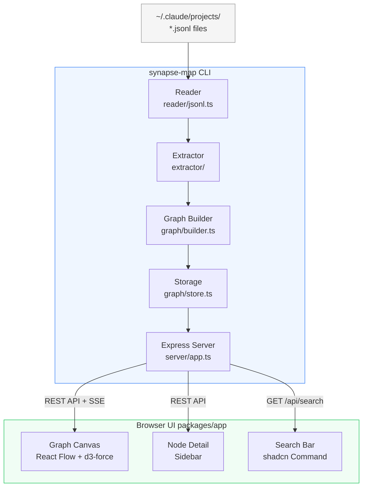
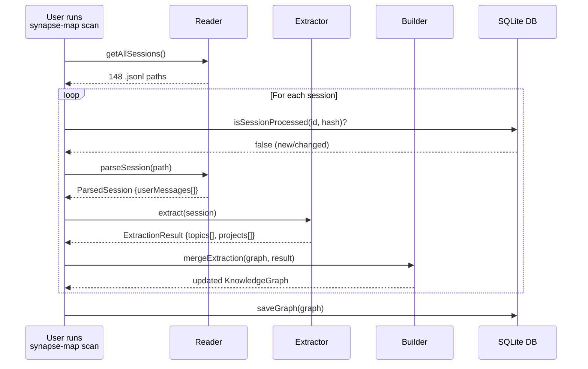
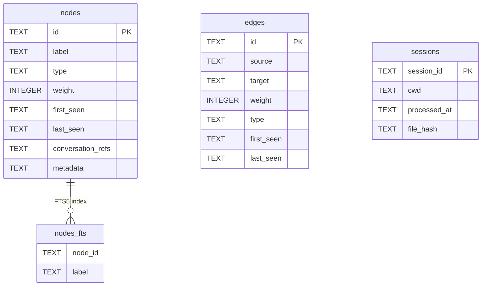

# Synapse Map — Architecture

This document is updated after each issue is completed. It explains what every file does, why it exists, and how the pieces connect.

---

## System Overview

Synapse Map transforms Claude Code conversation history into an interactive knowledge graph. It runs entirely on your local machine — no cloud, no API keys.

---

## Data Flow

---

## Module Reference

### `packages/cli/src/graph/types.ts`
**Why it exists:** Single source of truth for all TypeScript types. Every other module imports from here — changing a type here immediately surfaces type errors across the whole codebase.

| Type | Purpose |
|------|---------|
| `NodeType` | Union of node categories: `concept`, `project`, `decision`, `artifact`, `question`. Phase 1 uses `concept` and `project` only. |
| `GraphNode` | A single node in the knowledge graph. `id` is a stable slug (`"react"`), `weight` counts how many conversations mentioned it, `conversationRefs` lists which sessions. |
| `GraphEdge` | A connection between two nodes. `id` is always sorted alphabetically (`"react→typescript"`) to prevent duplicate edges. `weight` counts co-occurrences. |
| `KnowledgeGraph` | The full graph: `nodes` and `edges` stored as `Record<id, item>` (not arrays) for O(1) merge lookups. |
| `ProcessedSession` | Tracks which sessions have been indexed. `fileHash` (SHA-256) enables incremental scans — if the file hasn't changed, skip it. |
| `ParsedSession` | Output of the reader: the session's user messages as plain text, ready for extraction. |
| `ExtractionResult` | Output of the extractor: lists of topic and project labels extracted from one session. |
| `emptyGraph()` | Factory that creates a blank `KnowledgeGraph`. Used when no DB exists yet. |

---

### `packages/cli/src/reader/jsonl.ts`
**Why it exists:** Claude Code stores every conversation as a `.jsonl` file under `~/.claude/projects/`. This module is the only place in the codebase that knows about that file format.

| Function | Purpose |
|----------|---------|
| `getAllSessions()` | Walks `~/.claude/projects/` recursively and returns every `.jsonl` file path found. |
| `parseSession(filePath)` | Reads one `.jsonl` file. Extracts only `type === "user"` lines — assistant messages and system events are skipped. Handles two content formats: plain `string` and `array` (tool results mixed with text). Strips Claude Code system tags (`<system-reminder>`, `<bash-input>`, etc.) using a regex so only real user prose reaches the extractor. Returns `null` if the session has no usable messages. |
| `hashFile(filePath)` | SHA-256 of the raw file bytes. Used by `isSessionProcessed()` to skip unchanged sessions on re-scan. |

---

### `packages/cli/src/extractor/vocabulary.ts`
**Why it exists:** The fastest, highest-confidence extraction layer. A curated list of ~391 known tech terms (frameworks, languages, tools, databases, cloud platforms, AI/ML concepts, etc.) matched case-insensitively against conversation text.

Seeded from `job-search-tool/scripts/score_ats.py` `HARD_SKILLS` list and expanded with mobile, AI/ML, observability, architecture patterns, and more. No logic here — just the data.

---

### `packages/cli/src/extractor/aliases.ts`
**Why it exists:** Normalises variants before slugging so different spellings of the same concept map to one graph node.

Examples: `"postgres" → "PostgreSQL"`, `"ts" → "TypeScript"`, `"k8s" → "Kubernetes"`, `"rag" → "RAG"`. ~90 mappings covering abbreviations, casing variants, British/American spelling, and hyphen variants.

Seeded from `job-search-tool/scripts/score_ats.py` `TERM_ALIASES` and expanded.

---

### `packages/cli/src/extractor/tfidf.ts`
**Why it exists:** The static vocabulary can only find terms it already knows. TF-IDF finds terms that are *statistically unusual* in one session relative to the whole corpus — surfacing project-specific names (internal tools, company names, custom concepts) that no static list could contain.

| Export | Purpose |
|--------|---------|
| `TfIdf` class | Holds a corpus of tokenised documents. `addDocument()` adds a session. `topTerms(i)` returns the highest-scoring terms for document `i`. |
| `buildCorpus(sessionTexts)` | Convenience wrapper — tokenises all sessions and builds a `TfIdf` instance. |
| `topTermsForSession(messages, corpus, index)` | Returns the top N TF-IDF terms for one session, filtered to scores above 0.01 to remove near-zero noise. |

**Formula:** TF-IDF score = (term frequency in session) × log((N+1) / (df+1)) + 1, where N = total sessions and df = sessions containing the term. The +1 smoothing prevents division by zero on small corpora.

---

### `packages/cli/src/extractor/nlp.ts`
**Why it exists:** TF-IDF finds individual tokens; the vocabulary finds known terms. Neither reliably extracts multi-word proper noun phrases like "Knowledge Graph", "Clean Architecture", or "Domain Driven Design". `compromise.js` fills that gap with lightweight NLP noun phrase detection.

| Export | Purpose |
|--------|---------|
| `extractNounPhrases(text)` | Runs compromise NLP on the text, extracts nouns and proper nouns, title-cases them, filters against a 60-term stopword list (removes generic words like "thing", "issue", "user"), and drops phrases longer than 4 words or shorter than 3 characters. |

No model download — compromise is pure JavaScript, works fully offline.

---

### `packages/cli/src/graph/store.ts`
**Why it exists:** All graph data is persisted in a local SQLite database at `~/.synapse/graph.db`. This module is the only place that reads from or writes to that database.

Uses Node.js built-in `node:sqlite` (available since Node 22) — no native compilation required, no Visual Studio needed on Windows.

| Function | Purpose |
|----------|---------|
| `openDb()` | Opens (or creates) `~/.synapse/graph.db`, runs `CREATE TABLE IF NOT EXISTS` DDL, sets `PRAGMA journal_mode = WAL` for better concurrent read performance. Singleton — returns the same connection on subsequent calls. |
| `closeDb()` | Closes the connection and resets the singleton. Used by the `reset` command. |
| `isSessionProcessed(id, hash)` | Returns `true` if the session is already in the `sessions` table **and** its stored hash matches the current file hash. If either is false, the session needs processing. |
| `saveGraph(graph)` | Upserts all nodes, edges, and sessions inside a single `BEGIN`/`COMMIT` transaction. If anything fails, `ROLLBACK` ensures no partial writes. Node labels are also inserted into `nodes_fts` (FTS5) for full-text search. |
| `loadGraph()` | Reads all rows from `nodes`, `edges`, and `sessions`, deserialises JSON columns (`conversation_refs`, `metadata`), and returns a `KnowledgeGraph`. |
| `searchNodes(query)` | Appends `*` to the query for prefix matching and runs an FTS5 `MATCH` query on `nodes_fts` joined to `nodes`. Returns up to 20 matching nodes ordered by relevance rank. |

**Schema:**

---

## What's Next

```mermaid
flowchart LR
    subgraph Done ["✅ Done"]
        T1["#1 Monorepo"]
        T2["#2 Types"]
        T3["#3 JSONL Reader"]
        T4["#4 SQLite Store"]
        T5["#5 Vocabulary"]
        T6["#6 TF-IDF"]
        T7["#7 NLP"]
    end

    subgraph InProgress ["🔨 Tier 2 — Extraction"]
        T8["#8 RuleBasedExtractor"]
    end

    subgraph Tier3 ["⬜ Tier 3 — Graph Builder + Scan"]
        T9["#9 Merge Algorithm"]
        T10["#10 Scan Command"]
    end

    subgraph Tier4 ["⬜ Tier 4 — Server + CLI"]
        T11["#11 Express API"]
        T12["#12 Serve Command"]
        T13["#13 Status + Reset"]
        T14["#14 CLI Entry Point"]
    end

    subgraph Tier5 ["⬜ Tier 5 — React UI"]
        T15["#15–21 Frontend"]
    end

    Done --> InProgress --> Tier3 --> Tier4 --> Tier5
```

